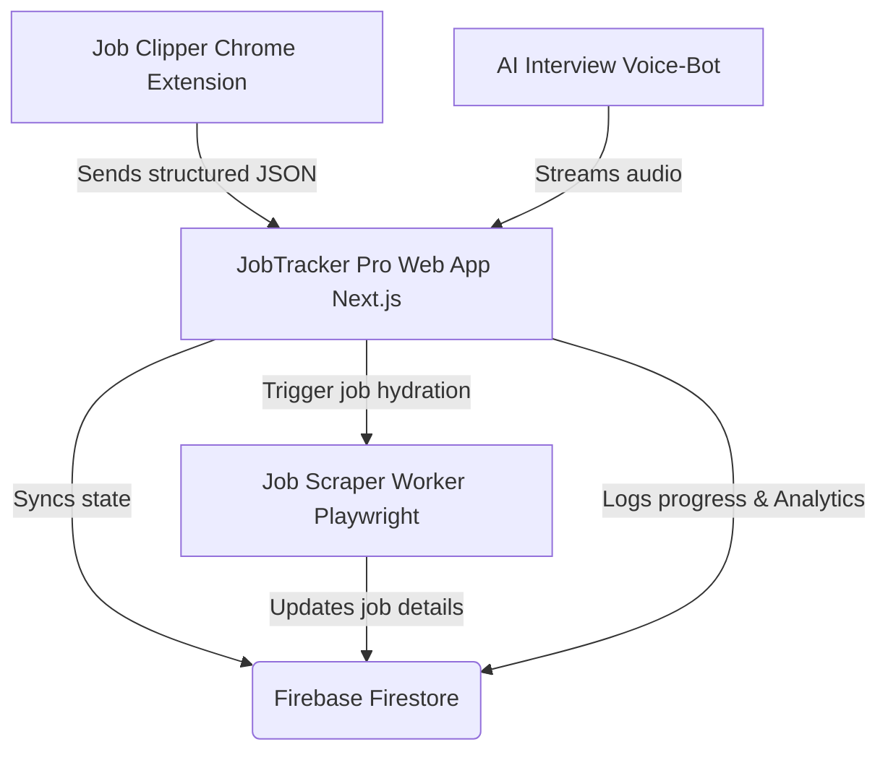

<div align="center">
  

  <br />
  <br />

  <h1>🚀 JobTracker Pro (Stitch Monorepo)</h1>
  
  <p>
    <strong>The Ultimate AI-Powered Job Application CRM & Interview Simulator</strong>
  </p>
  
  [**Explore Features**](#✨-key-features)
  | [**System Architecture**](#🏗-system-architecture)
  | [**Installation**](#⚙️-installation--setup)
  | [**Tech Stack**](#🛠-technology-stack)
</div>

<br />

---

## 📖 Overview

JobTracker Pro transforms the tedious job hunting process into a streamlined, automated, and intelligent pipeline. Managing hundreds of applications across multiple portals like LinkedIn and Indeed is now effortless. Our companion Chrome extension instantly clips job details, background scraping workers enrich application data, and the in-built **AI Voice-Bot Interview Simulator** preps you for the hardest HR rounds. 

This repository consolidates the entire full-stack ecosystem into a single project space.

---

## ✨ Key Features

### 1. 🤖 AI Video Mock Interview Simulator (Voice-Bot)
- Experiential voice interactions featuring dynamic personas, built into the Next.js app.
- Real-time Speech-to-Text streaming with flawless concurrency handling.
- Comprehensive post-session **Video Review Gallery** tracking behavioral markers.

### 2. ⚡ Chrome Extension Job Clipper (`job-clipper-extension`)
- **One-click Import:** Add job postings directly from LinkedIn and Indeed.
- Avoids manual copy-pasting—clips Job Title, Company, Description, Salary, and Apply Link directly into your Kanban board.

### 3. 🕸️ Headless Job Scraper Service (`job-scraper-service`)
- A standalone Playwright-powered Node.js worker.
- Executes complex background extraction jobs parsing difficult corporate career pages.

### 4. 📊 Real-time Kanban & Analytics Dashboard
- Powered by a robust **Firestore NoSQL** backend for instant state syncing.
- Recharts-based telemetry: Response Rate Funnels, Velocity Heatmaps, and Source Effectiveness charts.
- Integrated `react-calendar` seamlessly tying upcoming interviews to your applications.

---

## 🏗 System Architecture



---

## 🛠 Technology Stack

### Application & Frontend
- **Framework:** Next.js 15 (App Router) / React 19
- **Styling:** Tailwind CSS 4, Lucide React Icons
- **State Management:** Zustand
- **Visualizations:** Recharts for telemetry

### Backend, Database & Infrastructure
- **Datastore & Auth:** Firebase Firestore (Migrated from Prisma/PostgreSQL for offline+serverless sync) / Supabase Auth
- **AI Integration:** Google Generative AI (@google/generative-ai)
- **Background Queues:** BullMQ & Redis / Node.js Express workers

---

## ⚙️ Installation & Setup

Ensure you have **Node.js (v18+)**, **Redis** (local instance or remote), and a **Firebase project** setup.

### 1. Repository Setup
Clone the monorepo codebase entirely:
```bash
git clone https://github.com/24A31A05JX/JOB-TRACKER-PRO.git
cd stitch
```

### 2. Setting up the Next.js Web Client (`next-app`)
The core orchestrator of the platform.
```bash
cd next-app
npm install

# Setup Environment config
cp .env.example .env.local 
# Ensure FIREBASE, SUPABASE, and GOOGLE GEN-AI keys are populated!

npm run dev
```

### 3. Loading the Chrome Extension (`job-clipper-extension`)
1. Navigate to `chrome://extensions/`.
2. Toggle **Developer Mode** ON (top right corner).
3. Click "**Load unpacked**".
4. Select the `job-clipper-extension` folder inside this repository.

### 4. Running the Scraper Service (`job-scraper-service`)
Standalone Express/Playwright worker for heavy headless DOM parsing.
```bash
cd job-scraper-service
npm install

npm run dev
```


